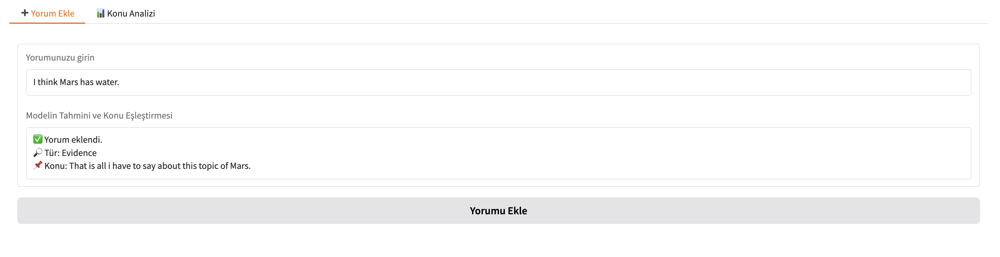
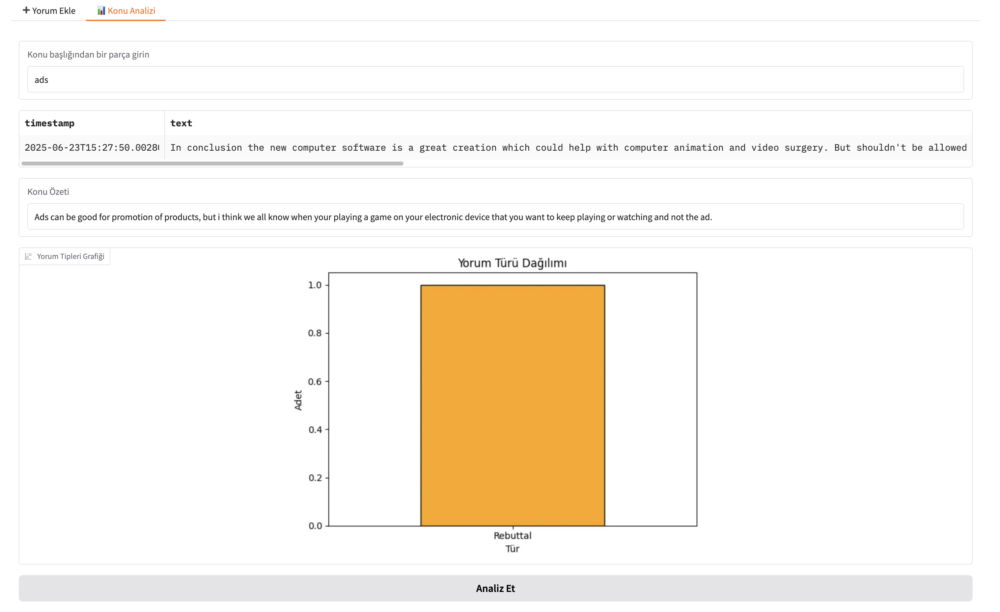

# 🧠 Social Media Analyzer

Gradio tabanlı web uygulamasıyla sosyal medya yorumlarını analiz et, sınıflandır ve konu özetleri üret!

## 📂Klasör Yapısı

```
socialmedia_analyzer/
├── app.py
├── requirements.txt
├── README.md
├── assets/
│   ├── konu analizi.png
│   └── yorum ekle.png
├── data/
│   ├── classified_opinions.csv
│   ├── conclusions.csv
│   ├── opinions.csv
│   └── topics.csv
```

## 📏 Genel Bakış

**Sosyal Medya Analizatörü**, sosyal medya üzerindeki kullanıcı yorumlarını analiz etmeye yönelik, kullanıcı dostu bir Gradio tabanlı web uygulamasıdır.
Bu uygulama, yorumların sınıflandırılması, ilgili konularla eşleştirilmesi ve konu bazlı özetlerin üretilmesini sağlayarak, sosyal medya metinlerinden anlamlı içgörüler elde etmeye yardımcı olur.

### Temel Yetenekler:

* Kullanıcı yorumlarını veri setine kolayca ekleme
* Yorumları argüman türlerine göre sınıflandırma
* Konularla anlamsal olarak eşleşen yorumları bulma
* Flan-T5 ile konu özeti üretme
* Görsel analiz ve grafiksel yorum tipi dağılımı
* Yeni yorumları otomatik olarak CSV’ye kaydetme


## 🛠️ Özellikler

### 📝 Yorum Ekleme

Kullanıcılar, sistem arayüzü üzerinden yorumlarını doğrudan ekleyebilir. Her yeni yorum, veri setine anlık olarak entegre edilir.

### 🔎 Konu Analizi

Kullanıcı ister yeni bir konu belirleyebilir, ister mevcut konular arasında seçim yaparak ilgili yorumları analiz edebilir.

### 🧠 Anlamsal Eşleştirme

Yorumlar, **SentenceTransformer** ile vektörel olarak dönüştürülür ve semantik benzerlik hesaplanarak en uygun konularla eşleştirilir.

### 🧬 Argüman Sınıflandırması

Yorumlar, **BART-MNLI** modeli (veya dilersen Gemini API) ile aşağıdaki argüman türlerine ayrılır:
`Claim`, `Counterclaim`, `Rebuttal`, `Evidence`.

### ✨ Otomatik Özetleme

İlgili yorumlardan elde edilen içerikler, **Flan-T5** modeli kullanılarak özlü ve bağlama uygun konu özetlerine dönüştürülür.

### 📊 Görselleştirme

Analiz edilen yorumların dağılımı, Matplotlib destekli interaktif grafiklerle görselleştirilir.

### 💾 CSV Güncelleme

Yeni girilen her yorum, sistem tarafından anında **`user_comments.csv`** dosyasına kaydedilir. Bu sayede veri seti canlı şekilde büyür.


## 🖥 Arayüz Ekranı

Uygulamanın arayüzü aşağıdaki bileşenleri içerir:

- Yorum Ekle sekmesi


- Konu Analizi sekmesi



- Otomatik konu özeti
- Yorum türü dağılım grafiği


